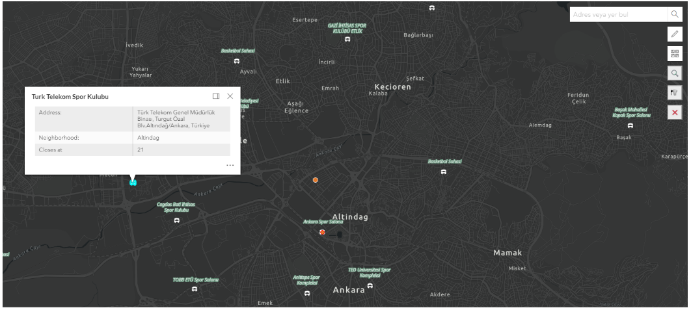
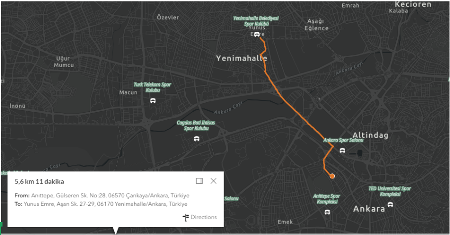
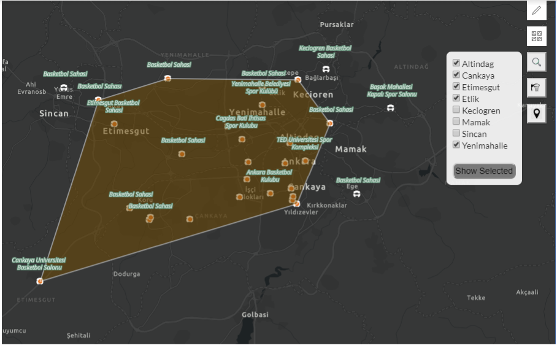

# BasketballFieldsTurkey
This is an small GIS project which shows you the Basketball Fields of Turkey (only Ankara for now) on the map. You can see field's properties such as closing time, address etc. and it allows you to add new Basketball Field or change the properties of existing one. It also helps you to find Basketball fields around you and gives you directions to find any basketball field that you selected to go.

The FeatureServer of the Baksetball Fields is created by myself using ArcMap 10.5.1 and it is published on ArcGIS Online. Esri's widgets and basemaps are strongly used in this project. To show directions, Google's Directions Service is used.   

